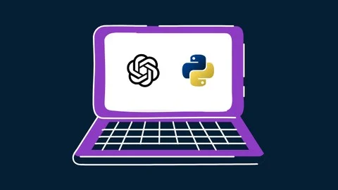

# Hello, I'm Rabbani

Hi! I am a Cybersecurity enthusiast and Computer Science student passionate about hands-on security, Python automation, and threat analysis.

## Objective

My journey in computer science has led me to develop a passion for cybersecurity, and I am now eager to transition into this field, specifically aiming to join a Security Operations Center (SOC) as a Tier 1 Analyst.

## Data Analysis Skills

| Skill                                     | Associated Projects                                                                                                                              |
| ----------------------------------------- | ------------------------------------------------------------------------------------------------------------------------------------------------ |
| Python for Data Analysis                  | <a href="https://github.com/worldquant-university">WorldQuant Data Labs</a>, <a href="https://github.com/maqrabbani">Amazon People Analytics</a> |
| Data Cleaning & Preprocessing             | <a href="https://extern.com">Extern.com Data Analysis Tasks</a>                                                                                  |
| Exploratory Data Analysis (EDA)           | <a href="https://github.com/worldquant-university">WQU Analytics Projects</a>                                                                    |
| Pandas & NumPy                            | <a href="https://github.com/worldquant-university">WorldQuant Deep Learning Fundamentals</a>                                                     |
| SQL (Joins, Filtering, Aggregations)      | <a href="https://github.com/maqrabbani">Practice Datasets & Assignments</a>                                                                      |
| Data Visualization (Matplotlib & Seaborn) | <a href="https://github.com/maqrabbani">Amazon People Analytics</a>                                                                              |
| Data Pipeline                             |                                                                                                                                                  |

## Cybersecurity Skills

| Skill                                         | Associated Projects |
|-----------------------------------------------|----------------------|
| SIEM Implementation and Log Analysis          | <a href="https://github.com/maqrabbani/Detection-Lab/tree/main">Boss of the SOC</a>, <a href="https://github.com/maqrabbani/Detection-Lab/tree/main">GetPDF</a> |
| Network Traffic Monitoring & Attack Detection | <a href="https://github.com/maqrabbani/Detection-Lab/tree/main">PacketDetective</a> |
| Security Automation with Shuffle SOAR         | <a href="https://github.com/maqrabbani/Detection-Lab/tree/main">SOAR alert enrichment</a> |
| Incident Response Planning & Execution        | <a href="https://github.com/maqrabbani/Detection-Lab/tree/main">Amadey</a>, <a href="https://github.com/maqrabbani/Detection-Lab/tree/main">Rhysida</a> |
| Case Management with TheHive                  | <a href="https://github.com/maqrabbani/Detection-Lab/tree/main">SOC case triage</a> |
| Scripting & Automation for Threat Mitigation  | <a href="https://github.com/maqrabbani/Detection-Lab/tree/main">Threat hunting automation</a> |

## Tools

### Network

    
    
    

### Endpoint

    
    

### SIEM

    
    
    

### Cloud

    
    

## Certifications

  
  
  
  
  
  

## Projects
- <a href="https://github.com/maqrabbani/Detection-Lab/tree/main">Detection Lab</a>
- SOC Automation Project

## My Udemy Courses

<table>
  <tr>
    <td align="center">
      <a href="https://www.udemy.com/course/learn-python-programming-with-chatgpt/" target="_blank">
         
        <b>Learn Python Programming with ChatGPT</b>
      </a>
    </td>
    <td align="center">
      <a href="https://www.udemy.com/course/linux-for-cloud-engineers-and-devops/" target="_blank">
         
        <b>Linux for Cloud Engineers and DevOps</b>
      </a>
    </td>
  </tr>
</table>

